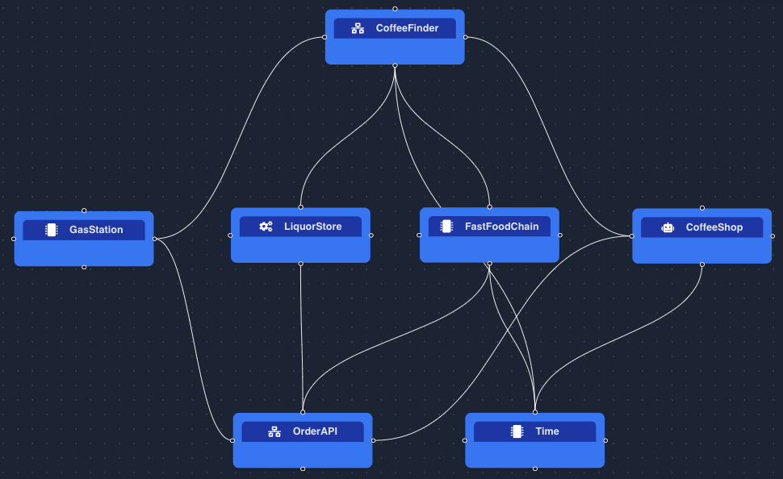
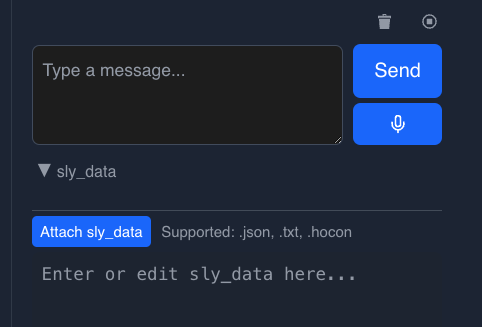

# Coffee Finder Advanced

This agent network is an advanced version of the Coffee Finder example.
It can:
* check the current time (can be overridden by the user)
* look for coffee options at that time of the day
* place orders on behalf of the user
* remember user preferences like favorite shop or usual order
* forget a user's data on request (full delete or single-fact removal)

It's good for testing:

* how multiple agents can provide the same service
* how to leverage AAOSA instructions to disambiguate
* how to ask for more information when needed, like a username
* how to call a CodedTool
* how to use sly_data to pass information to CodedTools
* how to use `PersistentMemoryMiddleware` for cross-session memory
* how to support memory deletion (forget flows)

## File

[coffee_finder_advanced.hocon](../../../registries/basic/coffee_finder_advanced.hocon)

## Description

Coffee Finder Advanced is an agent network that can suggest options for coffee locations
based on the time of day, place orders on behalf of the user and remember user preferences.
Here is what it looks like:



## Tools and Middleware

Coffee Finder Advanced uses 2 coded tools:
* **OrderAPI**, that can be called by the 4 shops. Order IDs increment per shop
within a session (e.g. 101 → 102 → 103 at Bob's).
* **Time**, used by CoffeeShop, FastFoodChain and CoffeeFinder.
The other 2 shops are open 24/7, so they don't need Time.

Check their code in the [CodedTools](../../../coded_tools/basic/coffee_finder_advanced) folder.
See for instance how [TimeTool](../../../coded_tools/basic/coffee_finder_advanced/time_tool.py) is implemented:
* no args
* first checks if `sly_data` contains a `time` key, and uses its value if present
* otherwise, uses the current time

Remember, `sly_data` is NOT visible in the chat, but it's passed to the CodedTools that can use it like any
regular dictionary argument.

**UserPreferences** is an agent that uses
[PersistentMemoryMiddleware](../../examples/tools/persistent_memory_local.md) (file-backed,
`json_file` backend) instead of coded tools. The middleware gives it six operations
(`create`, `read`, `append`, `delete`, `search`, `list`) and a topic summarizer.
Memory is stored under `memory/coffee_finder_advanced/UserPreferences/memory.json`.

## Example conversations

### Using current time

Let's assume current time is 8 am.

```text
Human:
Where can I get coffee?

AI:
You can get coffee at Bob's Coffee Shop, Henry's Fast Food, or Joe's Gas Station. All of these locations are open right now. Would you like to place an order?
```

Notice how Coffee Finder tells us these places are currently available, because they checked the time.
We can place an order:

```text
Human:
Get me black coffee from Henry's

AI:
Sure! May I have your name to place the order?
```

Coffee Finder is following-up with a question, because it's needed to place the order.
Let's provide it with a name:
```text
Human:
Mike

AI:
Your order has been placed:
- Order ID: 201
- Name: Mike
- Item: Black coffee
- Shop: Henry's Fast Food
```
### Overriding the current time in sly_data

Pass `sly_data` with your message to override the current time in the Time tool.
`sly_data` is just a dictionary:
```
{"time": "1 am"}
```

In the NSFlow UI, you can pass `sly_data` using the `sly_data` field under the `Message` field:



Let's see if the `Time` tool picks it up:

```text
Human:
message: Where can I get coffee?
sly_data: {"time": "1 am"}

AI:
Bob's Coffee Shop is closed.
Henry's Fast Food is closed.
You can get coffee at Joe's Gas Station, which is open now. Would you like to place an order?
```

Coffee Finder considers the time to be 1 am, and tells us some places are closed.

We can check the time by asking for it:
```text
Human:
message: What time is it?
sly_data: {"time": "1 am"}

AI:
It is 1 am.
```
Coffee Finder uses its `Time` tool and gives us the time.

Let's try to order from a place that's closed:
```text
Human:
message: Get me black coffee from Bob's Coffee Shop.
sly_data: {"time": "1 am"}

AI:
Bob's Coffee Shop is closed. Would you like to order from another location?
```

Good, it doesn't place the order because Bob's Coffee Shop is closed.
Let's order from Joe's Gas Station instead, as suggested:

```text
Human:
message: ok, order from Joe's instead
sly_data: {"time": "1 am"}

AI:
Sure! May I have your name to place the order?
```
Providing a name:
```text
Human:
message: Mike
sly_data: {"time": "1 am"}

AI:
Your order has been placed:
- Order ID: 301
- Name: Mike
- Item: Black coffee
- Shop: Joe's Gas Station
```

### Memorizing user preferences

Let's place more orders to see if Coffee Finder remembers user preferences.
Let's set the time to 8 am again:

```text
Human:
message: Liz here. Get me a cappuccino from Bob's Coffee Shop
sly_data: {"time": "8 am"}

AI:
Your order has been placed:
- Order ID: 101
- Name: Liz
- Item: Cappuccino
- Shop: Bob's Coffee Shop
```

Now let's reload or restart the server, and see if Coffee Finder remembers our preference:

```text
Human:
message: Hey, it's Liz. Get me the same as usual please.
sly_data: {"time": "8 am"}

AI:
Your order has been placed:
- Order ID: 101
- Name: Liz
- Item: Cappuccino
- Shop: Bob's Coffee Shop
```

You can check what Coffee Finder has memorized in `memory/coffee_finder_advanced/UserPreferences/memory.json`:

```json
{
  "mike": "[2025-09-09 16:22:27] Ordered black coffee from Henry's Fast Food at 8 am.\n[2025-09-09 16:23:37] Ordered black coffee from Joe's Gas Station at 1 am.",
  "liz": "[2025-09-09 16:25:23] Ordered cappuccino from Bob's Coffee Shop at 8 am."
}
```

### Forgetting user data

Coffee Finder can also forget a user's data when asked:

```text
Human:
message: Please forget everything about Liz
sly_data: {"time": "8 am"}

AI:
All stored data for Liz has been deleted.
```

After this, the `liz` topic is removed from the memory file entirely.

For more details on the persistent memory system, see the
[Persistent Memory (Local) documentation](../../examples/tools/persistent_memory_local.md).

## Testing

This network has an end-to-end memory test framework. Test fixtures live under
`tests/fixtures/basic/coffee_finder_advanced/` and each scenario is defined by up to
three files:

* `<scenario>.hocon` — the test interaction (messages, sly\_data, assertions)
* `<scenario>.initial_memory.json` — optional seed memory loaded before the test
* `<scenario>.expected_memory.json` — optional assertion schema checked after the test
  (supports `topics_present`, `topics_absent`, and `substrings_absent`)

When a test HOCON sets `sly_data["test_mode"] = true`, the `TopicStoreFactory`
redirects memory writes to `memory/test/`, keeping real persisted memory untouched.

Adding a new memory regression test is a no-code task: drop in a HOCON plus its
JSON sidecars.
